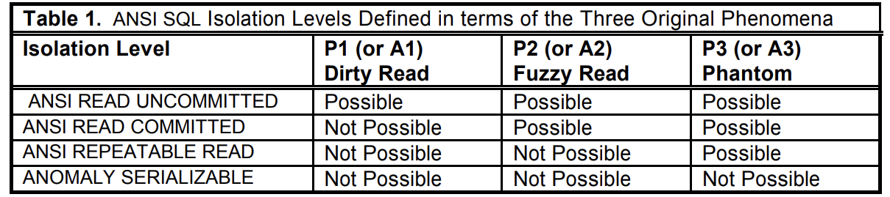
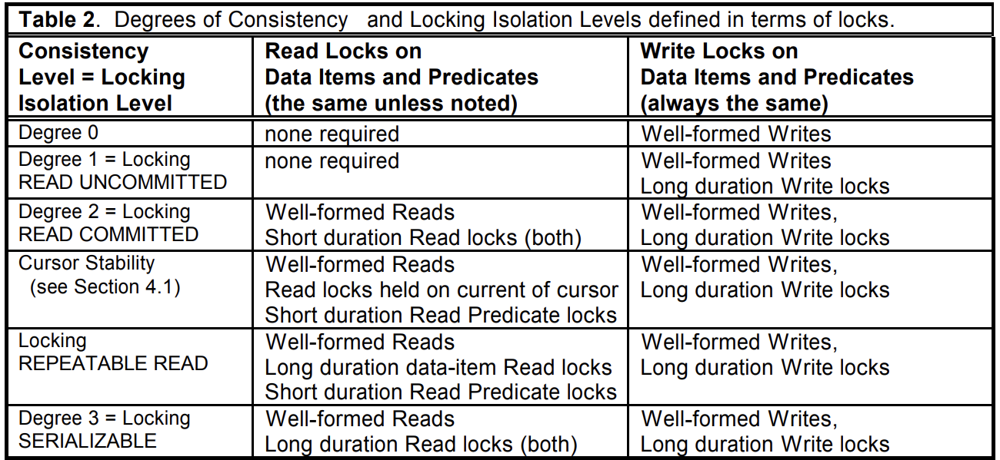
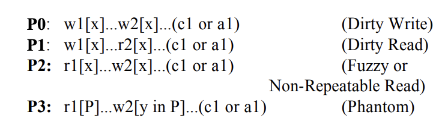
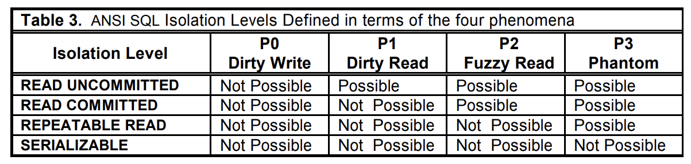

介绍了SI。

ANSI/ISO SQL-92 定义了四种隔离级别：

1. RU
2. RC
3. RR
4. Serializable

## 1. Introduction

同时还有三种异象：脏读、不可重复读、幻读。

ANSI隔离级别是和锁调度器的行为有关的。

第二节介绍了基本的隔离级别术语，定义了ANSI SQL和带锁隔离级别。

第三节检查了ANSI隔离级别的一些缺陷并且提出了新的现象。另外一些热门隔离级别也被定义。

第四节介绍了一种mvcc机制，叫做snapshot isolation。

第五节探索了一些异象来区分第三、第四节介绍的隔离级别。扩展以后的ANSI SQL缺乏分辨si和cursor stability的能力。

第六节进行总结。

## 2. Isolation Definitions 

### 2.1 Serializability Concepts

conflict是指不同事务的两个动作发生在同一个data item上，并且至少有一个动作是write。

dependency graph：定义了事物之间的数据流动。事务的动作在history被当作node，如果T1的op1和T2的op2 conflict，那么<op1,op2>会变成依赖图的一条边。如果两个历史拥有相同的提交事务和相同的依赖图，那么两个历史是等价的。

### 2.2 ANSI SQL Isolation Levels

介绍了strict和broad两个版本的ANSI SQL isolation levels。P代表broad版本，A代表strict版本。

### 2.3 Locking

Well-formed writes(reads)：在读写item之前先获取锁。

Two phase writes(reads)：释放掉第一个锁以后不再申请锁。

Long duration：锁直到commit 或者 abort才释放。

cursor stability：

isolation level L1 比 L2 弱，就记为 L1<<L2。

不可比较就记为L1 >> << L2。

locking RU << locking RC << locking RR << locking SERIALIZABLE

## 3. Analyzing ANSI SQL Isolation Levels

表2中定义的隔离级别至少和表1中的一样强。其实表2中的相同级别的隔离性更强。比如locking RU提供了long duration write locking来避免脏写，而ANSI SQL中除了ANSI SERIALIZABLE以外都不能避免脏写。

P0（Dirty Write）：为什么P0如此重要，是因为事务的回滚。如果没有P0级别的保护，那么系统不能做undo。比如w1[x] w2[x] a1.我们既不能通过从之前的x来undo w1[x]，因为这样会抹除w2[x]。但是如果我们不恢复之前的x，那么如果T2 之后abort了，我们也不能恢复x之前的值（因为恢复完以后就是w1[x]写入的值，而w1[x]是abort的），反正怎么弄都不行。所以最弱的locking system都long duration write locks。

Remark3：ANSI SQL isolation level应该对于所有的隔离级别都满足P0.

H1: r1[x=50]w1[x=10]r2[x=10]r2[y=50]c2 r1[y=50]w1[y=90]c1

对于上面这个例子，是不一致的，也是无法串行化的，但是没有违背任何的strict 隔离级别。把隔离级别换成broad以后，发现违背了broad isolation level。

Remark4:strict 解释A1，A2，A3有意向不到的弱点，正确的解释应该是broad，我们假定ANSI应该用于定义P1，P2，P3

Remart5:ANSI SQL是不完整的，仍然有一些异象可以发生，必须定义新的现象来完善locking。并且P3需要被重新描述。

下一节展示了一些介于RC和RR之间商业可用的隔离实现。我们假设P0和P1是基础，然后再加上一些有区别的现象。

## 4.Other Isolation Types 

### 4.1 Cursor Stability

用于防止lost update现象。

P4: r1[x]...w2[x]...w1[x]...c1 (Lost Update)

禁用P2也就排除了P4。说明P4至少比P2弱。那么说明RC << cursor stability << RR。

码农也可以直接用locking RR的方法来实现cursor stability，但是这样就不方便。

### 4.2 Snapshot Isolation

* 只能看到committed timestamp<start-timestamp的事务
* 不过可以读到自己的写操作

T1 [start,commit]可以提交，当且仅当没有其它事务和自己重叠并且对相同item进行写操作。不然不是最早的就abort自己，first committer-wins（通过write lock实现）

A5 (Data Item Constraint Violation)

A5A: r1[x]...w2[x]...w2[y]...c2...r1[y]...(c1 or a1) (Read Skew)

A5B: r1[x]...r2[y]...w1[y]...w2[x]...(c1 and c2 occur) (Write Skew)

P2是Read Skew的退化形式。A5A和A5B只能用于分辨低于RR的隔离级别。因为都出现了T2写   没提交T1的读（而RR对读是long durable locking的，在本事务提交以前是不会让其它事务读到该item的）。

Remark 8. READ COMMITTED « Snapshot Isolation：first committer-wins避免了P0，timestamp避免了P1，所以SI隔离性至少不比RC弱。并且，A5A可以在RC下是会出现的，但是在SI下是不会出现的，就说明SI隔离性肯定比RC强。

接下来就比较SI和RR。首先A2在si下不会发生，但是write skew会在si下发生，但是write skew不会在rr下发生，因此si允许RR不允许出现的异象。

但是si不会出现a3异象，但是RR会出现a3异象。总结一下就是si不会出现a3，但会出现a5b，而rr正好相反。

Remark 9. REPEATABLE READ »« Snapshot Isolation.

然而si不能排除P3，不过可以说si可以排除A1，A2，A3。

Remark 10. Snapshot Isolation histories preclude anomalies A1, A2 and A3. Therefore, in the anomaly interpretation of ANOMALY SERIALIZABLE of Table 1: ANOMALY SERIALIZABLE « SNAPSHOT ISOLATION.