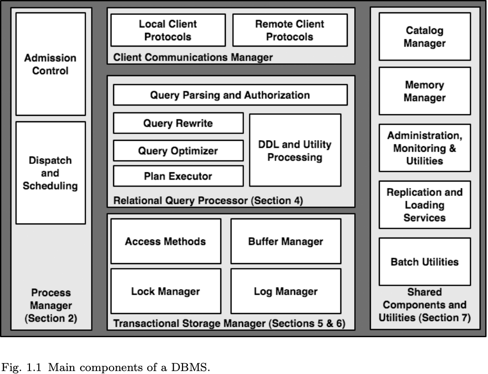
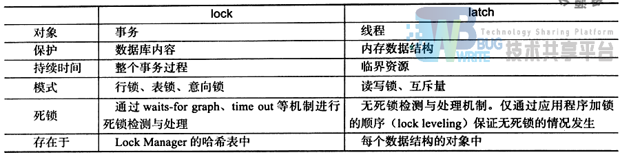

# Abstract

process model

Parallel architecture

Storage system design

Transaction system implementation

Query processor

optimizer architectures

Typical shared components

utilities

# 1. Introduction

这篇论文的目标是重点关注整体的系统设计以及强调那些教材上不怎么被讨论的问题，为更多广为人知的算法和概念提供有用的上下文。

## 1.1 Relational Systems: The Life of a Query

## 1.2 Scope and Overview

# 2. Process Models

当设计任何一个多用户服务器时，最先应该做的决定就是如何进行用户请求的并发执行，以及这些请求应该如何和操作系统进程或者线程相对应。我们先假设在单处理器上。

* 进程
* 内核线程
* 应用层线程（协程）

* DBMS Worker，，1:1映射到进程和内核线程

## 2.1 Uniprocessors and Lightweight Threads

两个用于简化的假设：

* 内核线程的支持：假设操作系统提供内核线程，并且一个进程可以有很大数量的线程。假设每一个线程的内存开销很小并且切换代价不高。
* 单处理器硬件：假设单CPU的单台机器。

对于Woker就有三种方案：

* 每个worker对进程
* 每个worker对线程
* 每个worker对进程池

### 2.1.1 Process per DBMS Worker

* 操作系统需要提供共享内存来给不同进程访问

* 开销大

### 2.1.2 Thread per DBMS Worker

* 线程之间隔离性不足
* 多线程debug困难
* 软件在不同OS之间移植起来麻烦，线程接口都不同

### 2.1.3 Process Pool

### 2.1.4 Shared Data and Process Boundaries

Disk I/O buffers:

* Database I/O Requests: Buffer Pool
* Log I/O Requests:Log Tail

Client communication buffers:

Lock Table:

## 2.2 DBMS Threads

之前的部分描述了一个简化版本的DBMS process models：我们假设OS threads是高性能的，并且DBMS只在单处理器系统上运行。接下来我们将放松第一个假设（OS threads）。关于多处理器部分在第三节会被讨论。

### 2.2.1 DBMS Threads

有些没有很好的OS thread支持的DBMS只能自己实现一个协程库。

## 2.3 Standard Practice

Process per DBMS worker :

Thread per DBMS worker：

* OS thread per worker
* DBMS thread per worker
  * DBMS thread on OS process
  * DBMS thread on OS threads

Process/thread pool:

## 2.4 Admission Control

如果不做准入控制，DBMS thrash就会出现：由于锁竞争带来的死锁、回滚、重启。

* 控制连接个数

* 通过query processor来控制。

  optimizer的查询计划可以知道：

  * query需要的随机和顺序I/O次数
  * query中运算符和元组被处理的CPU负载
  * query的数据结构内存占用，sort、hash的内存占用。

## 2.5 Discussion and Additional Material

query 和 worker 多多对应。

# 3. Parallel Architecture: Processes and Memory Coordination

这一节我们总结了标准DBMS术语，并且讨论了process models和memory对应关系。

## 3.1 Shared Memory

最大的挑战就是修改 query 执行层，利用共享内存的优势，将单个query跨多个CPU执行。

## 3.2 Shared-Nothing

水平数据分区。

典型的数据分区模式包括：基于元组属性的hash，基于元素属性的range，RR，range和hash的结合。

分区可能带来分布式死锁检测和2PC等问题。

部分失败也是一个问题。在共享内存系统中，一个处理器的失败往往导致整个DBMS的关闭。但是在不共享内存的系统中，一个节点的失败不会影响到集群中的其他节点，但是可能会影响到query的执行结果。有三种方法：

* 一个节点失败，关闭所有节点
* 跳过那些关闭节点的数据，这在可用性比完整性更重要的场景下可以使用。但是这样的方法没有定义良好的语义，因为DBMS经常被认为是记录的仓库，而可用性和一致性（完整性）的权衡被认为是更高的层面（经常在应用层）。
* 采用冗余方案，从完成的数据库故障转移到良好的粒度，chained declustering的优势是
  * 要求更少的机器用于保证可用性
  * 负载均衡

## 3.3 Shared-Disk

可以共享磁盘，但是不能共享内存。

优点是一个节点的失败不会影响到其他访问整个数据库（磁盘）。而shared memory系统一个节点失败，整个系统就停止了。shared-nothing系统一个节点失败，那么系统中至少有一部分数据是不能被访问的（除非有数据冗余）。然而，shared-disk也存在单点故障，如果数据在到达存储子系统前被破坏，那么系统中的所有节点都只能访问到脏数据。

由于shared disk数据是不存在分区的，disk data可以被拷贝进每一个节点的内存，那么需要做好数据共享的同步。shared disk系统依赖于分布式锁管理器和缓存一致协议（很像CPU的缓存一致性）。

## 3.4 NUMA

NUMA系统中处理器访问自己的本地内存会很快，但是访问非本地内存（内存位于另一个处理器，或者是处理器之间共享的内存）会慢一点。

NUMA硬件架构是位于shared-nothing和shared memory系统的中间系统。numa比nothing容易编程，比shared memory更加容易扩展到多处理器，因为numa可以避免共享点（共享内存总线）的竞争。

共享内存多处理器的内存经常被划分成区，并且每个区都和一部分处理器子集相联系。

* 当给处理器分配内存时，使用处理器本地的内存（避免使用较远的内存）
* 保证DBMS worker尽量被调度在同一个硬件处理器上

尽管NUMA集群几乎消失，但是编程模型和优化技术对于当前DBMS系统仍然很重要，因为许多大规模共享内存在其内存访问中存在明显的不一致性能表现。

从知乎查阅得：

开启NUMA会优先就近使用内存，在本NUMA上的内存不够的时候可以选择回收本地的PageCache还是到其它NUMA 上分配内存，这是可以通过Linux参数 zone_reclaim_mode 来配置的，默认是到其它NUMA上分配内存，也就是跟关闭NUMA是一样的。

**这个架构距离是物理上就存在的不是你在BIOS里关闭了NUMA差异就消除了，我更愿意认为在BIOS里关掉NUMA只是掩耳盗铃。**

**也就是在开启NUMA和 zone_reclaim_mode 默认在内存不够的如果去其它NUMA上分配内存，比关闭NUMA要快很多而没有任何害处。**

最有名的是这篇 [MySQL – The MySQL “swap insanity” problem and the effects of the NUMA architecture](https://link.zhihu.com/?target=http%3A//blog.jcole.us/2010/09/28/mysql-swap-insanity-and-the-numa-architecture/)（以下简称为2010年的文章）

我总结下这篇2010年的文章的核心观点是：

- 如果本NUMA内存不够的时候，Linux会优先回收PageCache内存，即使其它NUMA还有内存
- 回收PageCache经常会造成系统卡顿，这个卡顿不能接受。

CPU核越来越多，内存条数也越来越多（总内存是由很多条一起组合起来的），这样带来的问题就是一部分内存插在一部分core上，另外一些内存插在剩下的core上，从而导致了core访问不同的内存物理距离不一样，所以RT也不一样，这个**物理**距离是设计CPU的时候就带来了的，**无法改变！**。

要开NUMA，并且将进程绑定在core上。（原先的开NUMA导致page cache被回收的bug已经被修复）

## 3.5 DBMS Threads and Multi-processors

之前我们在单处理器下讨论了一些worker的process models，多处理器下就出现问题了。如何将多处理器利用起来就很重要。

一个好的经验法则就是每个处理器一个进程。

## 3.6 Standard Practice

用的比较多的是shared-disk和shared-nothing

## 3.7 Discussion and Additional Material

如何利用新处理器硬件。如何处理处理器和磁盘之间的速度差距。

如何恢复和备份数据。

分层部署DBMS。

# 4. Relational Query Processor

这一节我们主要关心查询处理器以及非事务方面的存储管理器的访问方法。

这一节我们主要关注DML表达式包括增删改查，而DDL表达式包括create table、create index一般不归查询优化器处理。DDL一般通过静态DBMS逻辑来显示调用 存储引擎和catalog manager的接口来实现。不过一些产品也开始优化一小部分DDL表达式。

## 4.1 Query Parsing and Authorization

给定一个SQL语句，SQL parser要做的有：

* 检查格式：规范化表名，
* 分解
* 将查询转化成优化器可以处理的格式
* 检查用户是否有权执行这条查询

four part name： server.database.schema.table。

如果一条查询经过parse，那么查询的内部格式就会被传递到查询重写模块。

## 4.2 Query Rewrite

重写的过程只能依赖查询语句和catalog中的元数据，并且不能访问表中的数据。

重写的任务如下：

* 视图展开（视图指的是一个虚拟表，只有定义，没有数据）：将from子句中的视图展开，如果有嵌套的视图，就递归展开
* 带有常量的算术表达式
* where中的谓词表达式
* 语义优化：如果Emp.deptno外键依赖于Dept。那么mep.deptno==Dept.dno就可以去掉，因为外键的默认属性就是这个。

* 扁平化子查询和其他启发式重写：查询重写需要将查询规划化，减轻优化器的工作。展开相关子查询尤其重要。相关子查询会导致跨查询块的循环嵌套，会限制子查询的执行，没办法利用到并行资源。

## 4.3 Query Optimizer

查询优化方法：

* plan space：左深、延迟笛卡尔积、右深、提前笛卡尔积
* Selectivity estimation： Selinger paper基于简单的表和索引基数。有一些系统使用抽样技术来估计数据的分布。
* Search Algorithms：自上而下搜索、动态规划
* Parallelism：有一些也支持 intra-query 并行，用多个处理器来加速单个查询。一些商业系统实现了两阶段：第一个阶段先选出单处理器下的最优计划，再将计划调度到多处理器上，虽然也不知道这么做有没有用。
* Auto-Tuning:如果存在其他索引，那么成本会变得如何？并按照那种方式来进行表的调整，然后再进行原来的查询。

### 4.3.1 A Note on Query Compilation and Recompilation

plan cache。

如果表的基数变动很大，plan cache就会被重新编译，因为可能这次表变动会影响到索引和join顺序的选择。

## 4.4 Query Executor

iterator模型：filescan、indexscan、sort、nested-loop join、merge-join、hash-join、 duplicate-elimination、grouped-aggregation.

### 4.4.1 Iterator Discussion

迭代器模型的一个重要特点就是将数据流和控制流结合在一起。

### 4.4.2 Where’s the Data?

iterators的数据从哪里来？如何在传递的？

* buffer pool tuples，可能忘记unpin
* memory heap，内存不够

### 4.4.3 Data Modification Statements

万圣节问题。可以避免使用索引 或者 在写之前就完成所有的读结果。

## 4.5 Access Methods

b+ tree、hash index。将search argument传入访问方法层。

二级索引中本来是放RID的，但是由于更新开销太大（每次移动tuple，都需要更新二级索引），就变成主键了。二级索引的value变成主键以后，即便tuple位置被移动了，二级索引仍然不用改变，只需要改变聚集索引即可，因为二级索引总是会回表。

## 4.6 Data Warehouses

* 数据仓库是DBMS的一个重要应用
* 之前讨论的查询优化和执行引擎不适合数据仓库，因此需要另外的拓展和修改

OLTP是数据库的应用，OLAP是数据仓库的应用。

### 4.6.1 Bitmap Indexes

那些column只有很少的取值（性别可取的值为男或者女）可以用bitmap。相比之下，如果b+树会要求（value，record-pointer）来对应每一条记录。

### 4.6.2 Fast Load

MVCC。

### 4.6.3 Materialized Views

* 物化视图
* 保持视图的更新状态
* 考虑在特定查询中物化视图的使用

### 4.6.4 OLAP and Ad-hoc Query Support

data cubes就是一种物化视图，被用在OLAP中。

### 4.6.5 Optimization of Snowflake Schema Queries

事实表，外键。星型模型。如果外键指向的表还可以再分层次，那就是雪花模型。

### 4.6.6 Data Warehousing: Conclusions

列存储在数据仓库中有很大优势。列存储很大的问题是行在表中的位置需要和所有的列保持一致，某一行更新位置了以后，该行所有的列都需要更新行位置信息。这对于OLTP是一个大问题，但是对于追加型数据仓库来说不是大问题。

## 4.7 Database Extensibility

### 4.7.1 Abstract Data Types

系统需要支持ADT的索引。

### 4.7.2 Structured Types and XML

三种方式来处理像XML一样的结构化类型：

* 构建一个定制的数据库，但效果不好
* 把XML当作ADT
* shredding XML

### 4.7.3 Full-Text Search

倒排索引表。

### 4.7.4 Additional Extensibility Issues

提供子系统生成或者修改查询计划，并且允许新的优化规则被单独注册。

数据库使用远程数据源。一个挑战是远程数据源不支持扫描。另一个挑战是远程数据源执行器生成结果太慢或突发的快。

## 4.8 Standard Practice

数据库系统之间的主要设计差异是优化器搜索策略（自上而下 vs 自下而上），查询执行器控制流模型（迭代器 vs 异步生产者消费者）。

### 4.9 Discussion and Additional Material

使用抽样数据来为聚合查询提供数值估计。

# 5. Storage Management

* 最直接和低级别的磁盘块存储驱动器交互
* 使用标准OS文件系统设备

## 5.1 Spatial Control

最好的办法是直接讲数据存储到磁盘设备中，不经过文件系统。

缺点：

* 需要将整个磁盘分区都用于DBMS
* 很难移植，因为访问磁盘接口和操作系统有关

所以直接访问磁盘的优势已经很小了。

## 5.2 Temporal Control: Buffering

如果DBMS使用标准文件系统接口进行write，那么OS buffer可能会通过延迟或者重拍write的方式来混淆DBMS的意图中，这会导致很多问题。

* ACID  WAL
* 操作系统对于write read的处理方式和DBMS不适合，文件系统只能通过物理字节偏移的连续性来read ahead，而DBMS可以通过SQL query process层面的逻辑预测来进行read ahead的决定，但这种方式不被文件系统理解。
* double buffer，很多时候磁盘I/O其实瓶颈，内存也可能是瓶颈。所以一些数据库通过hook的方式避免文件系统的cache，直接让DBMS控制页面替换策略。

### 5.3 Buffer Management

buffer pool= array of frame

hash table 

* 记录page number 和 buffer pool index 对应关系
* page 在disk中的位置
* 关于page的元信息

这个page其实就是程序中的逻辑页，对应的物理页就是buffer pool中对应的frame内容。

简单的LRU或者CLOCK对于全表扫描效果很差，所以需要进行一些改进。

## 5.4 Standard Practice

## 5.5 Discussion and Additional Material

* 新存储硬件的出现FLASH

* 数据库数据的压缩。

* 列存储

# 6. Transactions: Concurrency Control and Recovery

事务存储管理器：

* 锁管理器
* 日志管理器
* buffer pool
* access method

## 6.1 A Note on ACID

介绍了ACID

## 6.2 A Brief Review of Serializability

lock、latch

Serializability

三种并发控制手段：

* strict 2PL
* MVCC
* Optimistic concurrency control：多个事务被允许并发读写一个item并且不用阻塞。但是，每个事务需要维护他们各自的读写历史，并且在提交事务前检查是否有冲突，如果发现冲突，就将其中一个涉及冲突的事务回滚。

## 6.3 Locking and Latching

strict 2PL：

lock (lockname, transactionID, mode)

remove transaction (transactionID)

除了严格2PL，还有低级别的事务隔离：

unlock (lockname, transactionID)

lock_upgrade (lockname, transactionID, newmode)

有一些系统还支持

conditional_lock (lockname, transactionID, mode) ，该函数会立刻返回，并且指示是否成功获取到锁。如果没有成功，DBMS线程是不会在等待队列里排队的。

为了支持这些调用，lock manager需要维护两个数据结构：

* global lock table。lock name，mode，wait queue
* transaction table。pointer to transaction state，a list of pointers to all T's lock requests in lock table（方便所有和该事务相关的锁进行移除）

deadlock detector、waits-for cycles、

latch(object, mode)

unlatch(object)

conditional_latch(object, mode)

### 6.3.1 Transaction Isolation Levels

4种ANSI SQL隔离级别：RU、RC、RR、S。

Berenson又提出了ANSI SQL下的新问题。

* cursor stability：RC级别下，解决更新丢失的问题，对于read-think-write操作中的read加锁，直到事务结束。

但事实上，mysql中update的话，就会用当前读，不会造成更新丢失的现象。

* SNAPSHOT ISOLATION：【】【】获取事务开始的数据库快照，当一个事务提交的时候，看有没有另外一个事务区间是重叠的，并且对相同数据进行写。
* READ CONSISTENCY：类似SNAPSHOT ISOLATION。read consistency是第一个写者优先，而snapshot isolation是第一个committer优先。

## 6.4 Log Manager

WAL：

* 每一次对page的修改都要生成一条log record，log record flush要先于page flush
* log record按顺序flush
* commit log record flush 要先于commit reuqest返回

尽量快的方法：

DIRECT, STEAL,NOT-FORCE。但这样的方法需要做好redo和undo。

logical log vs physical log vs physiology。

ARIES论文中 physical log 用于 redo log，logical log用于undo log。