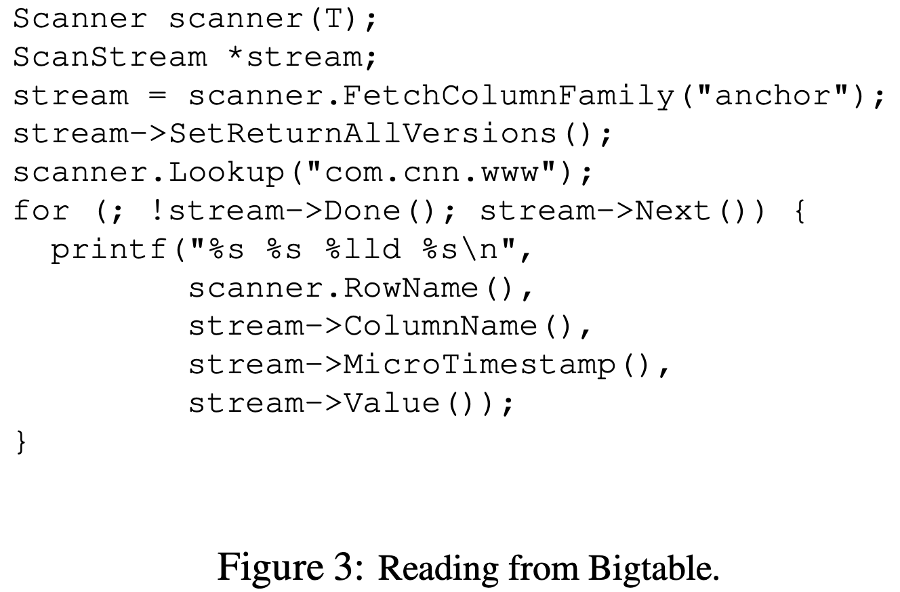

fBigtable: A Distributed Storage System for Structured Data

Fay Chang, Jeffrey Dean, Sanjay Ghemawat, Wilson C. Hsieh, Deborah A. Wallach Mike Burrows, Tushar Chandra, Andrew Fikes, Robert E. Gruber {fay,jeff,sanjay,wilsonh,kerr,m3b,tushar,fikes,gruber}@google.com 

Google, Inc.

## Abstract

BigTable是一个用于管理结构化数据的分布式存储系统。该结构化数据被设计成跨越几千台服务器的PB（10^15B)级数据的规模。

## 1 Introduction

在很多方面，Bigtable很像一个数据库：它和数据库共享很多实现策略。Bigtable不提供一个完整的关系数据模型，相反的，它给客户端提供一个支持动态控制数据布局和格式的简单数据模型，并且允许客户端推理底层存储中表示的数据。客户端可以通过仔细选择schemas来控制数据的位置。最后，Bigtable schema 参数让客户端可以动态控制是否服务内存或磁盘中的数据。

## 2 Data Model

Bigtable是一个稀疏、分布式、持久化的多维度排序map。该map以row key、column key、timestamp作为索引。map中的每一个value都是一个不可解释的字节数组。

(row:string, column:string, time:int64) → string

### Rows

每次对于单个row key下数据的读或写都是原子的（无论该行有多少不同种类的columns正在被读或者写。

每一行范围被叫做tablet，它是分布和负载平衡的单元。

### Column Families

Column keys被分组到成为列族的column families。

column key使用下列的语法进行命名：family：qualifier。column falimy names必须是可打印的，但是qualifiers可以是任意字符串。

### Timestamps

Bigtable中的每个单元格都可以包含某个数据的多个版本。这些版本按时间戳索引。

为了让版本数据的管理不那么麻烦，我们支持两种垃圾回收版本数据的方式。客户端可以指定回收之前n个版本，或者过去几天内的版本。

## 3 API

图2显示的C++代码使用RowMutation来执行一系列更新。

对Apply的调用执行了一个原子mutation。

图3显示的C++代码使用Scanner来迭代特定行中的所有anchors。

Bigtable支持几种其他特性来允许用户以更加复杂的方式控制数据。

*   支持单行事务。不支持跨行的事务，但是提供了一个跨行的batch write接口。
*   Bigtable允许单元格用作整数计数器。
*   支持在服务器的地址空间执行客户提供的脚本。

## 4 Building Blocks

Bigtable使用GFS来存储log和数据文件。一个Bigtable集群一般在一个共享的机器池上运行，该机器池同时还跑着很多种其他的分布式应用。Bigtable进程经常和其他应用的进程共享相同的机器。Bigtable以依靠一个集群管理系统来管理jobs，管理共享机器上的资源，处理机器故障和监控机器状态。

SSTable文件格式用于存储Bigtable数据。SSTable提供了一个持久化，有序的不可变的map，这个map的key和value都是任意的字节串。Bigtable提供operations来查找特定key的value，并且在特定key范围内迭代所有的key/value对。每个SSTable都包含一个blocks序列（每个block普遍是64KB，但是可以配置）。可以通过一次disk seek来完成block的查找：首先通过二分查找得到block index，然后再从磁盘中读取正确的block。可选的，一个SSTable也可以完整的映射到内存中，让我们可以不用接触磁盘来执行lookups和scans。

Bigtable依赖于一个高可用，持久化的分布式锁服务，叫做Chubby。一个Chubby服务由5个活跃的副本组成，其中之一是master并且服务请求。当大部分副本正在运行并且可以互相通信，那么服务就是活的。Chubby使用Paxos算法来保持故障时的副本一致性。Chubby提供了一个由目录和小文件组成的命名空间。每一个目录和文件都可以当作是一把锁，对文件的读和写是原子的。Chubby客户端库提供Chubby文件的一致性缓存。每一个Chubby客户端就维护着和Chubby服务的会话。一个客户端会话如果在lease失效时间到来前重新得到lease就不会失效。当一个客户端会话失效，它会释放所有的锁和打开的handles。Chubby客户端可以在Chubby文件和目录上注册回调函数来通知改变或者会话失效。

BigTable使用Chubby来完成很多种任务：保证在任何时刻最多只有一个活跃的master；存储Bigtable数据的引导位置（见5.1节）；发现tablet服务器和完成tablet服务器的死亡；存储Bigtable的schema信息（column family infomation）；store access control lists。如果Chubby在一段较长的时间中变得不可用，那么Bigtable也会变得不可用。

## 5 Implementation

Bigtable的实现有3个主要组件：一个用于链接每一个客户端的库，一个master和许多tablet服务器。可以在集群中根据工作负载的变化，动态添加或者删除tablet服务器。

master负责将tablet分配给tablet服务器，检测tablet服务器的增加和失效，平衡tablet服务器的负载，回收GFS中垃圾文件。处理table、column family创建的schema changes。

每个tablet server都管理一个tablets集合（普遍是每个tablet server 1000个tablets）。tablet server负责处理自己管理的tablets的read和write请求，也会分裂太大的tablets。

和很多单master的分布式存储系统一样，客户端数据不通过master移动：客户端直接和tablet servers进行read、write的通信。因为Bigtable客户端不依赖master来得到tablet的位置信息，所以绝大部分客户端从不和master通信。因此，在实践中master的负载比较小。

### 5.1 Tablet Location

我们使用三层类似B+树的层次来存储tablet位置信息（图4）。

第一层是一个存储在Chubby的文件，该文件含有root tablet的位置。root tablet包含所有tablets的位置，它们都在一个特殊的METADATA表中。每个METADATA tablet包含一个user tablets集合的位置。root tablet仅仅是METADATA表中第一个tablet，但是它被特殊对待，它永远不被split，这是为了保证tablet 位置的层次结构不超过3层。

METADATA表在一个row key下存储着tablet的位置，该row key是tablet的table identifier和end row编码而成。每一个METADATA row存储着大约1KB的数据。

客户端库缓存tablet位置。

### 5.2 Tablet Assignment

Bigtable使用Chubby来追踪tablet servers，当一个tablet server启动时，创建并且获取一把排他锁，也就是在一个特定Chubby目录中的一个独特名字的文件。master监控这个目录（the servers directory）来发现tablet servers。tablet server如果失去了互斥锁（由于一个导致server丢失Chubby会话的网络分区）就会停止对tablets的服务（Chubby提供了一个有效的机制来允许tablet server检查它是否还持有锁，该检查不会导致网络拥塞）。tablet server会尝试重新获取它的文件上的互斥锁，只要文件还存在。如果文件不再存在，那么tablet server就不会再服务，它杀死自己。任何时候tablet server终止（比如集群管理系统正在将tablet server的机器移出集群），它会释放掉锁，因此master可以重新分配tablets。

master负责监测什么时候tablet server不再服务tablets，并且重新分配那些tablets。如果tablet server报告它失去了锁，或者master经过几次尝试不能再联系上server，master就会尝试获取server‘s file上的锁。如果master可以获取锁，那么说明Chubby活着，并且tablet server死了活着联系不上Chubby了，因此master通过删除server file来确保tablet server不再服务。一旦server‘s file被删除，master将分配到该server上的tablets移动到未分配tablets集合中去。然而，master出故障不会改变分配到tablet servers上的tablets。

当master被集群管理系统启动时，当master可以改变tablets前，它需要发现当前的tablets分配。master在启动时执行下列的步骤：

1.  master在Chubby上获取独特的master锁，用来防止并发的master实例的生成。

2.  master扫描Chubby中servers directory来发现活着的servers。

3.  master和每个活着的tablet server通信，发现它们被分配到哪些tablets。

4.  master扫描METADATA表来学习tablets的集合。每当扫描到tablet没有被分配的，master将tablet加入未分配的tablet集合，该集合中的tablet可以用于分配。

有一个复杂之处就是在METADATA tablets分配之前，master不能扫描METADATA表。因此，如果root tablet没有在第3步被发现，master要将root tablet加入到未分配tablet中去。这个加入保证root tablet被分配。因为root tablet包含所有METADATA tablets的名字，所以master在扫描root tablet之后就知道所有METADATA tablets。

现有tablets的集合只会在表创建或者删除的情况下改变，两个现有的tablets被合并成一个更大的tablet，或者一个现有的tablet被分裂成两个小的tablets。Tablet分裂应该被特殊对待因为它们被一个tablet server初始化。 tablet server通过将新tablet记录在METADATA表中来commit split。当splt被commit以后，tablet server通知master。为了防止split通知丢失（可能是因为tablet server或者master死亡），当master要求tablet server加载正在分裂的tablet时，master会检测新的tablet。tanlet server会通知master split发生了，因为tablet server在METADATA表中发现的tablet entry只具备一部分master要求加载的tablet（因为split了）。

### 5.3 Tablet Serving

tablet的持久化状态保存在GFS中。updates被commit进一个存储redo records的commit log中。在updates中，最近提交的一些updates被存储在内存的一个有序的buffer中，叫做memtable。比较老的updates被存储在SSTables的序列中。为了恢复tablet，tablet server从METADATA表中读取元数据。元数据包含SSTables列表，包括一个tablet和一些redo points的集合。而redo points又是指向任何一个commit logs，commit log中可能会包含tablet的数据。server将SSTables的索引读到内存并且依靠redo points来apply全部提交过的updates。

当write operation到达tablet server时，server检查它是否结构良好，还有sender是否有权力执行mutation。检查权力时通过从Chubby文件读取被允许writers列表来实现的。有效的mutation被写到commit log中。当write被commit，它的内容就被插入到memtable中。

当read operation到达tablet server时，也要做结构和权限的检查，一个有效的read operation。一个有效的read operation需要合并SSTables和memtable上执行。

当tablets在split和merge时到来的read和write仍然可以继续。

### 5.4 Compactions

当write operation执行时，memtable会变大。当memtable的大小达到一个临界点时，memtable被冻结，一个新的memtable被创建，冻结的memtable被转换成SSTable并写入GFS。minor compaction过程有两个目标：减少tablet server的内存使用，当server死亡需要recovery时，减少需要从commit log读取的data量。当compactions发生时，到来的read和write operation可以继续。

我们会周期性的在后台执行merging compaction，merging compaction读取SSTables和memtable的内容，写到一个新的SSTable中。

Major compaction将所有的SSTables重写到一个SSTable中。由非major compactions生成的SSTables可以包含特殊的删除entries。major compaction会产生不包含deletion信息或者deleted data的SSTable。

## 6 Refinements

### Locality groups

客户端可以将多种column families组合到locality group。tablet的每个locality group会生成一个SSTable。

### Compression

很多客户端都是用两次压缩模式。第一趟是用Bentley and McIlroy's schema，用大窗口压缩长串。第二趟是用一个快速压缩算法来寻渣16KB窗口中的重复数据。

### Caching for read performance

为了提高read性能，tablet servers是用两层cache。Scan Cache时高层cache，缓存SSTable接口返回的key-value pairs。Block Cache缓存从GFS中读取的SSTables blocks。Scan Cache对应重复读取相同数据的应用十分有用，而Block Cache对于recently read的附近数据有用。

### Bloom filters

5.3节中提到，read operation必须读取所有组成tablet状态的SSTables。如果SSTables不在内存中，我们可能需要以多次磁盘访问结束。Bloom filters允许我们询问SSTable是否包含给定row/column pair的任何数据。

### Commit-log implementation

如果我们为每一个tablet分开保存commit log，那么就会同时向GFS中写入大量的文件。我们在每个tablet server的commit log中追加mutations。

使用单个log在普通操作中提供了重要的性能表现，但是在recovery时变得复杂。当一个tablet server死亡，它的tablets被移动到其他tablet servers。为了recover这些tablet，new tablet servers需要从commit log中读取对应的mutations。问题就是mutations时混合的，如果有100台机器，每台被分配到一个tablet，那么commit log就要被读取100次，这河里嘛？

为了避免重复读取commit log，我们首先将commit log进行排序，<table, row name, log sequence number>。为了防止将commit logs写入GFS时出现延迟峰值，每个tablet server事实上都有两个log writing threads，每个都写给的log file，一次只有一个thread在运行。如果写入性能不好，就切换到另一个线程，在commit log queue中的mutations都将由新的线程写。Log entries包含sequence numbers来让recovery进程可以忽略在log switch process中产生的重复entries。

### Speeding up tablet recovery

当master从tablet server移动tablet到另一个tablet server时，源tablet server首先在tablet上进行minor compaction。这个压缩减少了恢复时间。在完成这个压缩以后，tablet server不再服务该tablet。在tablet server实际卸载tablet之前，tablet server进行另一次minor compaction来消除在第一次minor compaction完成期间到来的未压缩log。完成第二次minor compaction之后，tablet可以被加载到另一个tablet server上来。

### Exploiting immutability

包括SSTable缓存在内，Bigtable系统的其他部分被简化是因为所有生成的SSTable都是不可变的。唯一可变的数据结构就是可以被read和write访问的memtable。为了减少读取memtable时的竞争，我们将每一个memtable行设计成COW，允许reads和writes并行处理。

## 7 Performance Evaluation

## 9 Lessons

