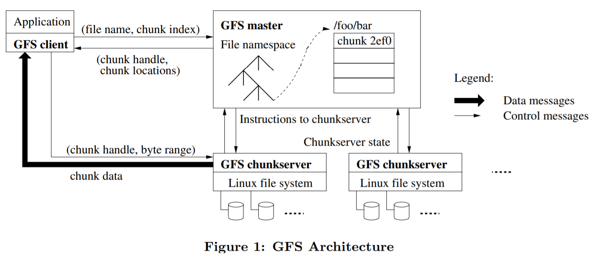
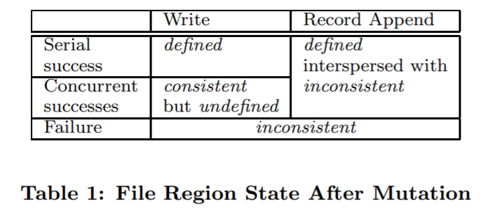
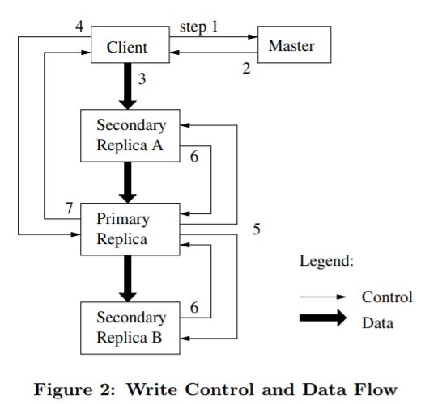
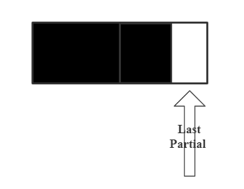
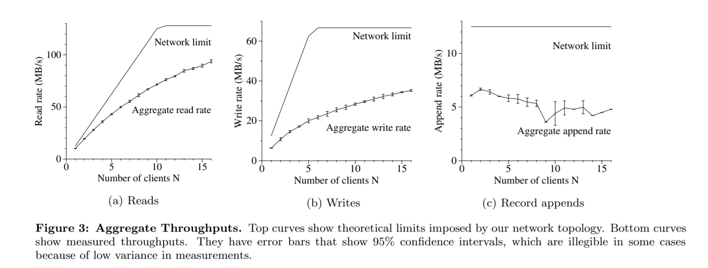
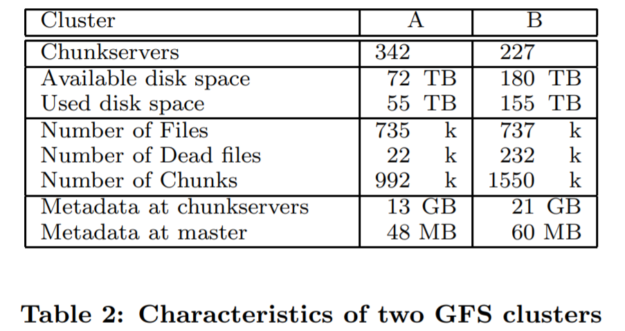
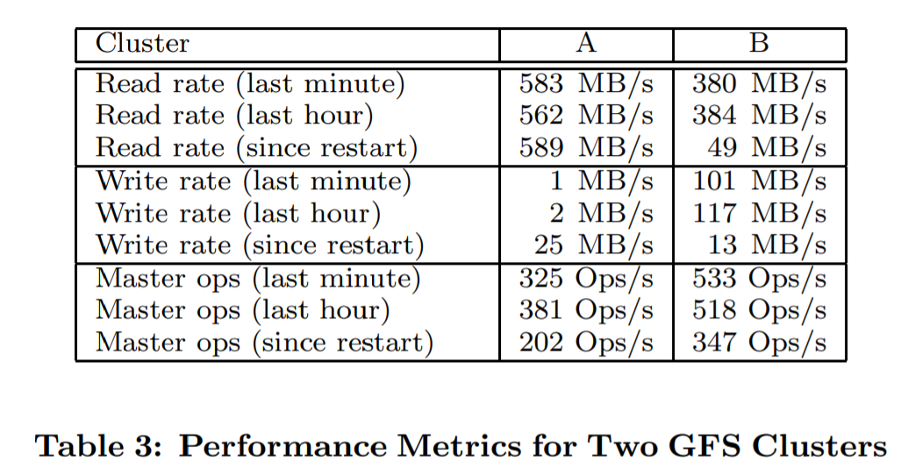
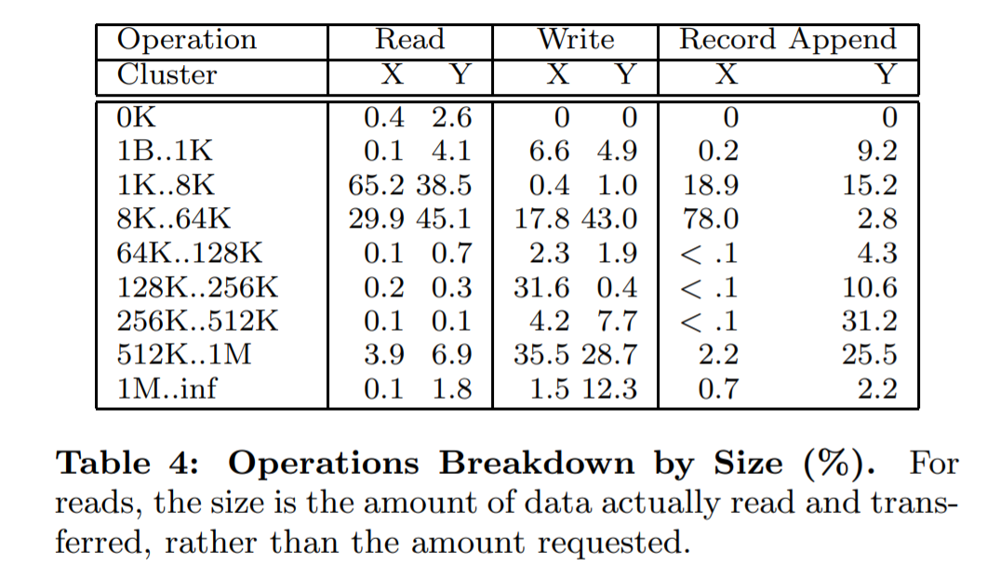
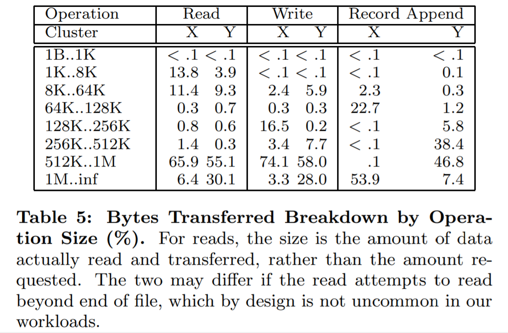
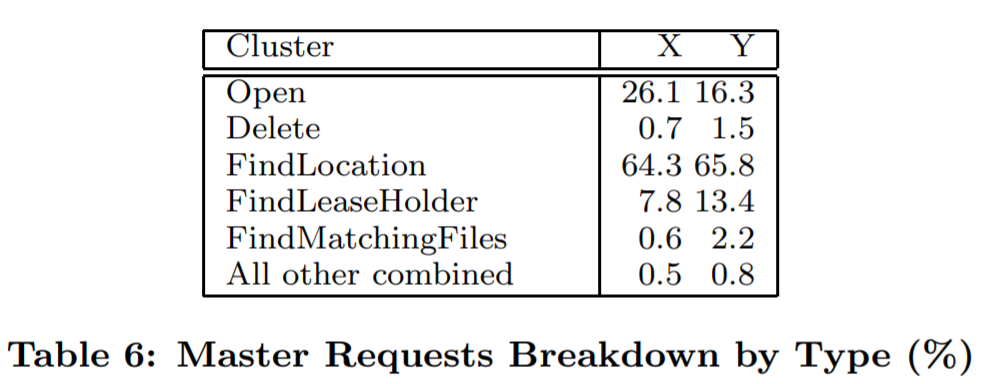

# The Google File System 

Sanjay Ghemawat, Howard Gobioff, and Shun-Tak Leung 

Google∗ 

原文地址：https://pdos.csail.mit.edu/6.824/papers/gfs.pdf

注：文本中的块=chunk。

## ABSTRACT

在这篇论文中，我们展示了文件系统被设计用于支持分布式应用的接口拓展， 讨论我们设计的许多方面，并且对micro-benchmarks和现实世界的使用做测量报告。

## General Terms

Design, reliability, performance, measurement

## Keywords

Fault tolerance, scalability, data storage, clustered storage 

## 1.INTRODUCTION 

1. 组件故障是常态而不是例外。
2. 按照传统标准，文件很大。
3. 绝大部分文件的改动是通过追加新数据而不是重写已有数据。
4. 通过协同设计应用程序和文件系统API，整个系统增加了灵活性。举个例子，我们放宽了GFS的一致性模型来简化文件系统，而不会给应用程序带来繁重的负担。我们也介绍了一种原子追加操作所以多个客户端可以并发向文件追加而不用应用程序进行额外的同步。

## 2.DESIGN OVERVIEW 

###  2.1 Assumptions 

* 系统由很多便宜的经常出错的组件构成。
* 系统存储着少量的大文件。我们预计有几百万个文件，每个文件通常是100MB或者更大。几个GB的文件是常见的，而且应该被有效管理。系统支持小文件，但是我们不需要为它们优化。
* 工作负载主要包含两种类型的read：大型流式read和小型随机read。
* 工作负载还包含很多大型顺序write追加数据到文件。
* 系统必须为多个客户端并发追加到相同文件提供高效的实现。
* 高持续带宽比低延时更加重要。

###  2.2 Interface 

GFS提供相似的文件系统接口，不提供标准API类似POSIX的实现。我们支持常见的操作如create、delete、open、close、read和write文件。

GFS提供snapshot（3.4节）和record append（3.3节）操作。snapshot以低成本创建了一个文件或者目录树的拷贝。record append允许多个客户端并发的向同一个文件中追加数据，并且保证每个客户端追加的原子性。这在实现多路合并结果和生产者消费者队列中很有用，客户端可以不用额外的锁来同时追加。

### 2.3 Architecture

 文件被划分成固定长度的chunks。每一个chunk都在创建时被master分配全局不变的64bit chunk handle。Chunkservers把chunks当作Linux文件存储在本地磁盘中。每一个chunk都被多个chunkservers复制。

master维护所有的文件系统元数据。包括命名空间、访问控制信息、从文件到chunk的映射和chunks的当前位置。它也控制系统范围内的活动就像chunk lease管理、孤儿chunks的垃圾回收、chunkservers之间的chunk迁移。master周期性的用HeartBeat信息和每一个chunkserver进行通信，发送指令和收集状态。

client和chunkserver都不缓存文件数据。client进行缓存几乎不能带来收益，因为绝大部分应用流规模较大，很难被缓存。不缓存文件数据简化了client和整个系统处理，避免缓存一致性带来的问题（当然clients需要缓存元数据）。chunkservers不需要缓存文件数据是因为chunks被当做本地文件来存储，因此Linux缓冲区已经在内存中缓存了频繁被访问的数据。

### 2.4 Single Master 

使用单master简化了我们的设计，使得master可以使用全局知识来完成复杂的chunk placement和replication decisions。当然，我们必须减少master在reads、writes中的参与，否则master会成为瓶颈。clients从不通过master read或者write文件数据。相反的，client询问master应该联系哪一个chunkserver。client会在一段时间内缓存这个信息，并且后续的操作都直接和chunkservers交互。

参考图1，让我们来解释一个简单的read做了哪些交互。首先因为使用的是固定长度的chunk，client将应用程序制定的文件名和字节偏移转换成文件内的块索引。然后client将文件名和块索引作为请求内容发送给master。master回复对应的chunk handle和副本的位置。client使用文件名和块索引作为key缓存了master的回复。 

client发送请求到其中一个replica，绝大多数情况下是最近的一个。该请求明确chunk handle和该chunk下的字节范围。之后的相同chunk的请求不再需要client-master交互，除非缓存信息失效或者文件被重新打开。

### 2.5 Chunk Size 

chunk size=64MB。Lazy space allocation可以避免由于内部碎片带来的空间浪费。

###  2.6 Metadata

master存储三种主要的元数据类型：文件和块命名，从文件到块的映射，每一个块的副本们的位置。所有的元数据都保存在master的**内存**中。头两种类型也通过operation log记录改变，并被持久化在master的本地磁盘中，同时在remote machines上复制。master不会持久化的存储块位置，它会在启动时询问每一个chunkserver中的chunks，还有每一个chunkserver加入集群时也会询问。

#### 2.6.1 In-Memory Data Structures

 master在后台周期性的扫描整个状态，这样的周期扫描可以用于实现chunk垃圾回收、chunkserver出现故障时的re-replication、用于平衡负载的chunk迁移、跨chunservers的磁盘空间使用。4.3和4.4节会讨论这些活动。

master为每个64MB的chunk维护少于64B的元数据。

#### 2.6.2 ChunkLocations

master不需要持久化记录给定一个chunk，哪个chunkserver持有该chunk的副本。master在启动时通过和chunkservers的poll获取该信息。当chunkservers加入离开集群、改名、故障、重启时，减少了保持master和chunkservers之间同步的问题。

从另一个角度来理解这样的设计，我们要明白chunkserver对chunks是否在自己的磁盘中有最终话语权。因此在master上持久化保存这些信息没意义，chunkserver上发生的任何错误都会导致chunks消失。

#### 2.6.3 Operation Log

operation log包含了关键元数据改变的历史记录。这是GFS的核心。它不仅是元数据的唯一持久化记录，而且它作为定义并发操作的逻辑时间线服务。

我们将它复制到多台远程机器上并且只有当把对应的log record刷到本地磁盘和远程磁盘后才会回应客户操作。

master通过重新执行operation log来恢复文件系统状态。为了减少启动时间，我们必须保持log处于小的状态。当log增长超过一定大小master会checkpoint状态，因此master可以从最近的checkpoint开始重新执行operation log来恢复。

因为创建checkpoint需要一段时间，master的内部状态被构建成当一个新的checkpoint被创建时不会延迟incoming mutations。master切换到新的log文件并且用一个单独的线程创建checkpoint。新的checkpoint包含切换前的所有mutations。对于一个几百万个文件的集群来说创建新的checkpoint大概需要1分钟。当创建完成后，被写到本地和远端机器上。

### 2.7 Consistency Model

 GFS有一个宽松的一致性模型来支持我们的分布式应用。

#### 2.7.1 Guarantees by GFS 

文件命名空间的mutatoins是原子的。他们被master专门处理。

defined是consistent的子集。

一个文件区域是consistent当所有客户端不管读到哪个replicas都能看到相同的数据。一个区域是defined的，当发生file data mutation后如果它还是consistent的并且所有客户端都能完整看见mutation。当mutation没有被并发的writers干扰，成功执行时，受影响的区域就是defined（同时也是consistent）。并发成功mutations保持区域undefined但是consistent：所有的客户端会看到相同的数据，但是不会反映出写了哪个mutation。通常相同的数据由来自多个mutations的混合片段组成。一个失败的mutation使得区域inconsistent（因此也是undefined）：不同的客户端可能在不同的时间点看到不同的数据。

在一连串的成功mutations之后，被修改的文件区域被保证是defined，并且包含最后一次mutation写的数据。GFS通过如下方法实现这个：

* 将mutations以相同的顺序应用到所有副本上去。

*  使用chunk version numbers来检测是任何一个replica是否因为它的chunkserver关闭了导致错过了mutations。

GFS通过master和所有chunkservers之间的常规handshakes和通过检验和检测数据损坏来识别出错的chunkservers。当问题出现时，数据会尽快从合法的副本中读出。当chunk的所有副本在GFS能反应前（通常需要几分钟）丢失，chunk就不可逆的丢失了。即使是在这种情况下，数据也是不可用，而不是损坏：应用程序会收到明确的错误，而不是损坏的数据。

#### 2.7.2 Implications for Applications

* append rather than overwrites
* checkpoint
* writing self-validating, self-identifying records. 

？？？

## 3. SYSTEM INTERACTIONS 

我们在设计系统时减少master对所有operations的参与。在此背景下，我们现在描述client，master和chunkservers如何交互来实现数据改变，原子记录追加和快照。

### 3.1 Leases and Mutation Order 

一次mutation是改变chunk内容或者元数据的操作，每一次mutation都要在所有该chunk的副本上执行。我们使用lease来维护不同replica的一致性mutation。master授予其中一个replica（称作primary）lease。primary为这些mutations选择一个连续顺序。所有replicas在应用mutations时都要遵循这个顺序。lease的初始超时时间是60s。master可以撤销在lease失效之前revoke（当master不想在一个正在改名的文件上应用mutations时）。当master丢失和primary的通信时，可以在旧的lease失效后给与另一个replica新的lease。

如果write很大或者跨越了chunk边界，GFS客户端会将write分解成许多write操作。他们都遵循control flow但是可能会和其他客户端的并发操作交织并覆盖。因此，共享文件区域可能包含不同客户端的段，尽管replicas是相同的因为所有单个操作都以相同的顺序在所有replicas上执行。这使得file region处于consistent、undefined的状态。

### 3.2 Data Flow 

我们的目标是充分利用每一台机器的网络带宽，避免网络瓶颈和高延迟。

数据沿chunservers的链路线性推送，而不是通过其它拓扑进行分布式推送。

最后通过在TCP连接上流水线传递数据来减少延迟。一旦chunkserver接收一些数据，它立刻开始转发。

### 3.3 Atomic Record Appends 

这个record指的就是chunk中的data，而不是operation log。

record append是GFS提供的一种原子追加操作。record append遵循control flow，只在primary处有一些额外的逻辑。primary追加数据到自己的chunk中，告诉secondaries明确的offset去写数据，然后最终primary回复success到客户端。

？？？

### 3.4 Snapshot

快照是拷贝文件或者目录树，并且尽量不中断正在进行的mutations。 

使用COW来实现快照。当master收到一个快照请求时，它首先会revoke任何一个即将快照的文件中的chunk的leases。这可以保证任何后续的write操作必须和master交互来找到lease持有者。这给了master创建chunk副本的机会。

在lease被revoked或者失效以后，master将操作记录到磁盘。然后通过复制源文件或者目录树的元数据将log record应用到内存状态。新创建的快照文件指向和源文件相同的chunks。

当快照操作后第一次有一个客户端想要write chunk C。客户端发送请求到master发现当前的lease holder。master注意到chunkC的应用超过了1。master就延迟对客户端请求的回答，转而挑选新的chunk handlerC'。然后master询问每一个拥有chunkC副本的chunkserver创建一个新的chunk C'。通过在相同chunkservers上创建新的chunk，我们保证数据在本地拷贝，而不是通过网络。从这点出发，请求的处理就完全一样了：master给chunkC'副本的其中一个lease，并且回复客户端现在可以正常write chunk，客户端不必知道已经拷贝了一个新的chunk。

## 4. MASTER OPERATION

### 4.1 Namespace Management and Locking

没有目录数据结构来列出里面所有的文件。也没有文件别名（像Unix里的软硬链接）。

文件名和绝对目录名都有read-write lock。

文件创建不需要获取父目录的write lock是因为根本没有“directory”或者“inode”的数据结构来保护不被修改。对于父目录名字的read lock已经足够保护不受删除。

### 4.2 Replica Placement

chunk replica placement策略主要有两个目标：最大化数据可靠性和可用性，最大化网络带宽的使用。仅仅在机器之间传播replica是不够的的，我们必须across racks传播chunk replicas，这样即便整个rack毁坏了也有chunk replica存活。

### 4.3 Creation, Re-replication, Rebalancing  

creation

放置初始化的空replicas时，需要考虑几个因素：

* 磁盘空间利用率低于平均值的chunkservers。
* 限制每一个chunkserver上的“recent”创建次数。
* 跨越不同的racks。

re-replication

根据几个因素确定re-replication的优先级。

rebalancing  

相较于立即使用heavy write traffic填满new chunks，rebalancing逐渐的填满chunserver是一种更好的行为。

### 4.4 Garbage Collection

文件被删除后，GFS采用惰性垃圾回收。

#### 4.4.1 Mechanism

文件被删除时，master会写opration log。然而并不立刻回收志愿，而是将文件重命名成一个隐藏的名字，并且包含删除时间戳。当master进行常规扫描时，会移除超过3天的隐藏文件（这个时间间隔可以设置）。在那之前，文件可以以新名字被read，也可以通过命名回常规名字来undeleted。当隐藏文件从命名空间移除时，内存中的对应的元数据才会消除。

常规扫描中，master会标识孤儿chunks并且擦除元数据。在master和每个chunkserver的HeartBeat信息中，chunkserver会报告有的chunks子集，master会回应没有元数据的chunks的标识。chunkserver就可以释放掉这些chunks。

#### 4.4.2 Discussion

提到了延迟垃圾回收的一些优点和缺点。当然用户可以在某些目录树下指定replication和gc的策略。

### 4.5 Stale Replica Detection  

 对于每一个chunk，master维护一个特chunk version number来区别up-to-date和stale replicas。

每当master授予一个新的lease给chunk时，它会增加chunk的version number并且通知up-to-date副本。master和这些up-to-date副本都会将new version number记录在持久化状态中。如果某一个replica不可用，那么它的chunk version number就不会增加。当拥有stale replica的chunserver重启并将chunks状态汇报给master时，master会检测是否有stale replica。如果master发现一个version number更大，那说明自己的那个出错了，更新自己的version number。

master在gc时移除stale replicas。在那之前，当回复客户端关于chunk信息的请求时，认为stale replicas不存在是一种高效的办法。client和master在做很多操作时会检查version number是否up-to-date，例如通知客户端哪个chunkserver持有某个chunk的lease，指挥一个chunkserver从另一个chunkserver上读取chunk。

## 5.FAULT TOLERANCE AND DIAGNOSIS

### 5.1 High Availability

我们使用两个简单有效的策略保持整个系统高可用：fast recovery、replication。

#### 5.1.1 Fast Recovery

无论他们是怎么被终结的，master和chunkserver都被设计成在数秒内恢复状态并启动。

#### 5.1.2 Chunk Replication

虽然当前replication做的很好，但是我们也在探究使用其他形式的跨服务器冗余，像奇偶校验码或纠删码。

#### 5.1.3 Master Replication

master的状态也会被复制。它的operation log和checkpoints都会被复制到多台机器上。mutation只有在刷到本次磁盘和所有replicas后才会被认为是committed。如果master出错，GFS外的监控基础设施开启一个新的带有replicated operation log的master进程。客户端只使用master的标准名称，该标准名称是一个DNS别名，因此master可以被重定位到另一台机器上。

当primary master关闭时，shadow masters只提供只读访问。它们是shadows，而不是mirrors，因为它们可能稍微落后于primary几分之一秒。事实上，因为文件内容是从chunkservers中读取的，应用程序不会观察到陈旧的文件内容。应用程序只会观察到陈旧的元数据。

### 5.2 Data Integrity

每一个chunkserver都是用校验和来检测数据的损坏。因为GFS mutations的语义，尤其是atomic record append，不能保证副本之间是完全相同的。因此每一个chunkserver必须通过检验和来检验自身拷贝的完整性。

一个chunk是64KB大小，每一个chunk都有32bit的校验和。就像其它元数据，校验和被保存在内存中，并且通过logging持久化存储。

检验和对于read来说几乎没有影响。校验码的查找和比较用不到I/O，因此校验和计算可以经常和I/O重叠。

校验和针对write做了很多的优化，因为它们是我们工作负载的主要部分。当write是append时，我们只增量计算last partial checksum block以及全新的checksum block。即使last partial checksum block已经被损坏并且我们没能检测到它，在下一次读的时候也可以检测到损坏（因为那一个block的新checksum是用旧checksum加上新加入数据计算出来的）。

如果write是重写一段已经存在的chunk时，我们必须检验第一和最后一个block，然后执行write，然后计算新的校验和。

在空闲时期，chunkservers可以扫描检验不活跃chunks的校验和。

### 5.3 Diagnostic Tools

广泛而详细的诊断日志在问题隔离、调试和性能分析方面起到了不可估量的作用，同时只产生了最低限度的成本。

## 6.MEASUREMENTS

这一节我们展示了一些micro-benchmarks来阐明GFS架构和实现的瓶颈，同时也有一些数字来自Google正在使用的真实集群。

###  6.1 Micro-benchmarks

####  6.1.1 Reads

####  6.1.2 Writes 

#### 6.1.3 Record Appends

### 6.2 Real World Clusters

#### 6.2.1 Storage  

#### 6.2.2 Metadata

chunkserver上保存的唯一的元数据是chunk version number。

master上保存的元数据更小。因此我们之前假设在实践中，master内存的大小不会限制系统的容量。master上的元数据包括文件名、文件所有权和权限、从文件到chunks的映射、每一个chunk的当前version、当前replica位置和引用次数。

chunkserver恢复很快只需要几秒钟，master要挣扎30-60s，直到从所有chunkservers取到chunk位置信息。

#### 6.2.3 Read and Write Rates 

#### 6.2.4 Master Load 

#### 6.2.5 Recovery Time 

### 6.3 Workload Breakdown 

#### 6.3.1 Methodology and Caveats 

#### 6.3.2 Chunkserver Workload 

#### 6.3.3 Appends versus Writes 

我们的data mutation workload是appending占主导地位而不是overwriting，overwriting一般是出错或者超时导致的重试机制。

#### 6.3.4 Master Workload  

## 7.EXPERIENCES  

我们最大的问题之一就是磁盘和Linux driver相关。有的Linux版本可能导致磁盘出现损坏的数据。这个问题驱动我们使用校验码来检测数据损坏，同时我们修改了Linux内核代码来处理这些协议的不匹配。

因为fsync()（同步写，同时刷数据和元数据到磁盘），我们在Linux2.2内核上有些问题，它的开销和文件大小成比例而不是和修改部分。在我们实现checkpointing之前，修改大的operation log就成了问题。我们通过同步写解决了这个问题，并最终迁移到Linux 2.4。

另外一个Linux问题就是线程中的reader-write lock，当线程从磁盘中读取page（reader lock），或者调用mmap修改地址空间（writer lock）。我们看到在系统处于轻负载，并且找不到资源瓶颈或者硬件错误的情况下会出现短暂的超时。最终，我们发现lock阻塞了primary网络线程去映射新数据到内存，因此磁盘线程实际上是在之前映射过的数据上分页。因为我们主要被网络接口所限制，而不是被内存拷贝带宽，所以我们通过将mmap（）替换成pread（）来解决额外拷贝的开销。

## 8.RELATED WORK 

## 9.CONCLUSIONS

我们的系统通过持续监控、复制重要数据和又快又自动的recovery来容错。chunk replication让我们有chunkservers上的容错。我们还是用校验码来检测磁盘上的数据损坏。

我们的设计在许多并发readers和writers执行不同的任务时提供高吞吐量。我们通过分离文件系统control和data来实现这个效果，control通过master，data直接在chunkservers和clients之间传输。 通过给与primary replicas权限来尽可能减少master在operations中的参与，因此简单而又中心化的master不会成为瓶颈。

## ACKNOWLEDGMENTS

## REFERENCES  