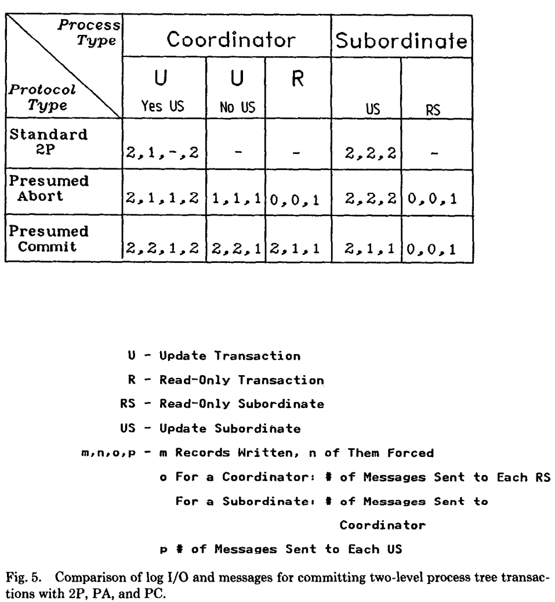

题外话：3PC通过弱化数据一致性减少了阻塞，数据一致性角度来看是要比2PC弱的，因为3PC的第二阶段如果发现活着的节点处于precommtted，但是有一个节点和协调者宕机的话，其实还是不能保证最终是commit还是abort的，这就和2PC的第一阶段一模一样了。2PC通过带来阻塞确保强一致性。其实2PC也可以通过弱化数据一致性的方式来减少阻塞，只不过在这种情况下3PC不一致的可能性要比2PC略小，所以我们普遍的说2PC是可能阻塞的强一致性，3PC是没有阻塞的弱一致性。

不过3PC的第一二阶段取消阻塞的办法是不会造成数据不一致的，因为无论如何都不会出现某个节点commit的状态，所以也无所谓。

这篇论文主要描述了R*的提交协议，Presumed Abort（PA）和Presumed Commit（PC）。PA和PC是2PC的拓展。

# 1.INTRODUCTION

R*做了基础的批量force writes。

这篇论文集中于提交协的性能方面，特别是在无错误情况下的logging和communication性能。

R*是用2PL来实现事务串行化的隔离级别，可能出现死锁，通过死锁检测，让替罪羊事务abort来解决死锁问题。

首先展示2P。

然后从2P逐步衍生出两个新协议PA，PC。

然后展示性能比较，优化和PA，PC的拓展。

接下来展示R*进行全局死锁检测和解决的方法。

最后通过概括R*的当前状态来做出结论。

# 2.THE TWO-PHASE COMMIT PROTOCOL 

## 2.1 2P Under Normal Operation 

1. coordinator Prepare
2. subordinates who is willing to commit,force write log、send YES VOTE、wait for final decision，进入prepared状态，只能等待协调者给出下一步决定。
3. subordinates who is not willing to commit, force write log,send NO VOTE,因为已经VETO，所以从节点可以直接本地abort了，不用等待协调者第二阶段的消息。forget transaction
4. 协调者收到所有投票都是YES VOTE，force write commit record、send COMMMIT给所有从节点。写完commit record就说明到达了 commit point，可以直接向用户返回commit了。
5. 协调者收到的投票中有一张是NO VOTE，force write abort record、send ABORT给所有从节点（only prepared 或者没有回应第一阶段的从节点）。
6. 每个从节点接收到COMMIT后，就进入committing state，force write commit record，send ACK，然后commit 事务。forget。
7. 每个从节点收到ABORT后，就进入aborting state，force write abort record，send ACK，然后aborts 事务。forget。
8. 协调者收到所有节点的ACK（那些第一阶段没有给出abort回应的从节点）以后，write end record。forget。

## 2.2 2P and Failures

recovery process 处理来自其他从节点的recovery process发来的消息并且处理所有在宕机前正在执行commit protocal的事务。利用持久化存储在内存中恢复事务信息。这个信息是恢复进程用来回答从节点询问，以及发送消息给从节点的。

当恢复进程发现正处于prepared状态时，它会周期性的尝试联系协调者来获取接下来应该做什么。当恢复进程发现某一个事务没有写commot protocol log record，那么恢复进程就不知道该事务到底是协调者还是从节点。恢复进程只能undo该事务，write abort，forget。如果恢复进程发现某一个事务正在committing或者aborting，那么恢复进程会给所有没有确认的从节点发送相应的committing或者aborting，并且等待从节点的ACK。一旦所有节点的ACK到了，恢复进程write end，forget。

如果协调者进程在等待从节点的投票时，注意到了一个从节点的宕机，那么协调者会abort该事务。如果协调者在等待ACK时宕机了，那么协调者会将事务转交给恢复进程。

如果一个从节点在发送YES VOTE并进入prepared前注意到协调者宕机的话，就可以单方面abort事务。另一方面，如果从节点进入prepared后宕机，那么从节点会将事务转交给恢复进程。

当一个恢复进程收到来自prepared从节点的询问信息，就会查看内存中的信息。如果信息指明该事务正处于aborting或者committing状态，就返回正确的回应。问题是，如果没有查找到信息怎么办？因为询问着进入prepared并且没有收到commit或者abort，说明被询问者处于以下几种情况：

* 刚刚发出prepares
* 在接收到所有投票和作出commit/abort决定前宕机
* 重启，abort事务，没有通知任何从节点。

这几种情况下，abort事务都没有问题，所以对于一个在内存中找不到信息的询问来说，abort。

## 2.3 Hierarchical 2P

在层次结构中，root process是协调者，leaf process是从节点。而对于internal process来说，既是协调者（对于它的子进程来说）也是从节点（对于它的父进程来说）。

# 3.THE PRESUMED ABORT PROTOCOL

如果持久化存储中没有信息就默认是abort，那么abort record 就没必要force write，并且从节点没必要在接收到abort消息后返回ack。甚至协调者都没必要在abort record中记录从节点的名字或者在abort record后写下end record。同时，当协调者在尝试发送abort给从节点时发现从节点宕机了，协调者没必要将事务转交给恢复进程，协调者会让从节点通过从节点恢复进程询问的方式来发现abort。注意到这些改变并没有改变协议的性能。

我们不用事先知道事务是否只读。如果一个叶子进程接收到prepare并且发现自己不用做任何更新（没有写UNDO/REDO），那么叶子进程就会发送read vote，release lock。这个叶子进程没有写任何 log record。对于这个叶子进程来说，无论事务最后是abort还是commit都是无所谓的。所以协调者没必要给这个从节点发送commit/abort。

如果root process也是只读的，并且只接收到read votes，那么就不会有第二个阶段，这种情况下root process也write no log record。另方面，如果root process或者其中一个子节点投了YES并且没有其他子节点投NO，那么root process表现的像2P。

总结一下：对于一个完全只读事务，没有进程会写log record，但是但是每一个非叶子节点都会发送prepare给子节点，并且每一个非根节点都会发送read vote。

对于一个部分只读事务，根节点会发送prepare、commit给每一个更新子节点和prepare给每一个只读子节点。每一个更新的非叶子非根节点会发送prepare、commit给每一个更新子节点，一个prepare给非更新子节点，两个yes vote、ack给协调者（因为这个节点以下可能既有更新节点，也有非更新节点）。每一个只读的非叶子非根节点就相当于上一段说的完全只读事务（因为这个节点以下都是只读节点）。

通过对于层次2P的改进，我们得到了PA协议。这个名字是由no information情况下事务假定是abort的事实得到的。

# 4.THE PRESUMED COMMIT PROTOCOL

因为绝大部分事务都被期待是commit，所以可以要求abort的ack，而不要求commit的ack。同理，可以要求abort的record，而不要求commit的record。这样做的结果就是，对于no information的情况，恢复进程会回复commit。这么做就会产生问题。

root process发prepare，子节点进入prepared状态，在root收到所有votes并做决定前，root 宕机。注意这时候root没有写任何protocol log record。当root恢复进程起来，就会abort这个事务，forget，并且不通知任何人，因为没有任何关于子节点的信息。然而，当处于prepared状态的子节点恢复进程询问root恢复进程时，root恢复进程会应答commit，这就出现了不一致。

在发prepare前，force write collecting record。

只force write abort，ack for abort，只在abort 后 write end。

注意表格中2P（2，1，-，2）和PA（2，1，1，2）的差别：2P默认是update的，所以没有RS。而PA只用发prepare，所以是1。

