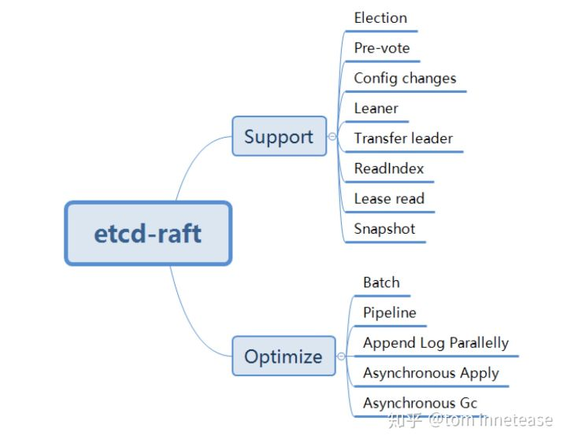
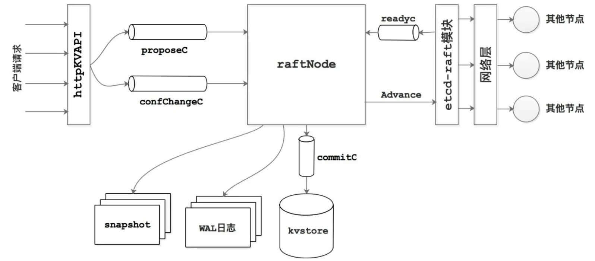
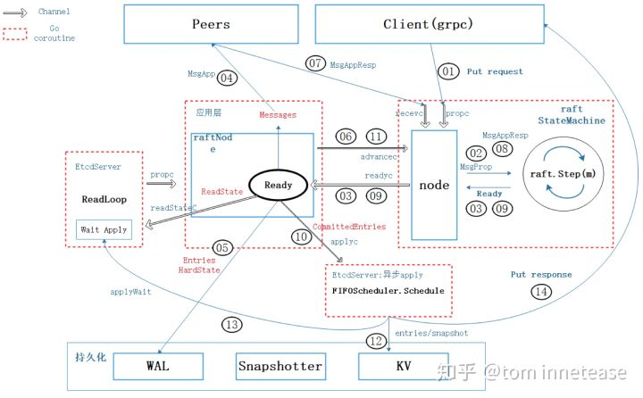
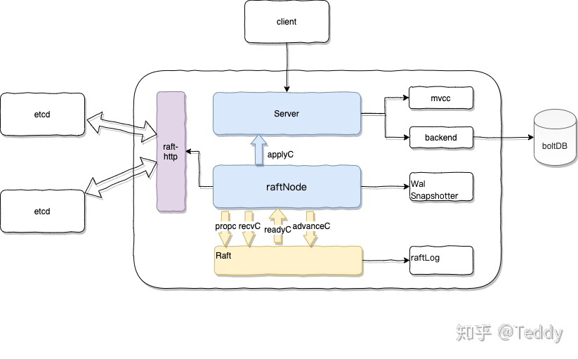

很多raft实现都有集成式实现，包括storage handling、message serialization、network transport，etcd/raft这个库只实现了raft算法的核心部分。

network、disk IO都留给用户完成，用户还需要实现信息传输，persist storage。

Message -> State machine -> {[]Messages,[]LogEntries,NextState}

This raft implementation is a full feature implementation of Raft protocol. Features includes:

- Leader election
- Log replication
- Log compaction
- Membership changes
- Leadership transfer extension
- Efficient linearizable read-only queries served by both the leader and followers
  - leader checks with quorum and bypasses Raft log before processing read-only queries
  - followers asks leader to get a safe read index before processing read-only queries
- More efficient lease-based linearizable read-only queries served by both the leader and followers
  - leader bypasses Raft log and processing read-only queries locally
  - followers asks leader to get a safe read index before processing read-only queries
  - this approach relies on the clock of the all the machines in raft group

This raft implementation also includes a few optional enhancements:

- Optimistic pipelining to reduce log replication latency
- Flow control for log replication
- Batching Raft messages to reduce synchronized network I/O calls
- Batching log entries to reduce disk synchronized I/O
- Writing to leader's disk in parallel
- Internal proposal redirection from followers to leader
- Automatic stepping down when the leader loses quorum
- Protection against unbounded log growth when quorum is lost


raftlog结构体，和它的方法--主要记载了raftlog和snapshot的处理方式。

raft 结构体，和它的方法 -- 主要把raft协议中的逻辑处理部分单独拎出来，不涉及网络通信，持久化等，只实现raft协议的功能。

node结构体和Node interface-- 给持久化，网络通信一个合适的channel，当channel收到信息，底层调用raft结构体的方法。

最后是raftnode，也就是一个具体的实现（具体的实现指的是：wal用什么，持久化数据库用什么，网络通信怎么走等等）。

下图是etcd-raft 实现的raft算法功能以及一些优化。

raft/node.go是node的实现, raft/raft.go是raftStateMachine,也就是raft核心算法的实现。

contrib/raftexample/raft.go是raftNode，也就是raft server的实现。



下两图是etcd-raft的整体架构





两个coroutine驱动：node的listen coroutine

raft node 的处理conroutine:处理raft StateMachine生成的Ready，该持久化的持久化，该发送给Peer的发送给Peer。

raftNode:raft server

raft statemachine:raft算法的逻辑实现，msg->raft statemachine->ready

node:raft stateMachine 接口。输入+运转

node.Propose -> channel -> coroutine(listen all kinds of Msg) ->raftStateMachine.Step -> Ready -> channel -> coroutine

---

接下来先根据etcd server收到一个put kv请求的详细流程来阅读一下源码。

```go
// node is the canonical implementation of the Node interface
type node struct {
	propc      chan msgWithResult
	recvc      chan pb.Message
	confc      chan pb.ConfChangeV2
	confstatec chan pb.ConfState
	readyc     chan Ready
	advancec   chan struct{}
	tickc      chan struct{}
	done       chan struct{}
	stop       chan struct{}
	status     chan chan Status

	rn *RawNode
}
```

1. Node实现了Propose接口，Propose可能会丢失并且没有任何通知，所以由客户端来计时并重试。

2. 

   ```
   func (n *node) Propose(ctx context.Context, data []byte) error {
   	return n.stepWait(ctx, pb.Message{Type: pb.MsgProp, Entries: []pb.Entry{{Data: data}}})
   }
   func (n *node) stepWait(ctx context.Context, m pb.Message) error {
   	return n.stepWithWaitOption(ctx, m, true)
   }
   ```

3. stepWithWaitOption

   ```
   	ch := n.propc
   	pm := msgWithResult{m: m}
   	if wait {
   		pm.result = make(chan error, 1)
   	}
   	select {
   	case ch <- pm:
   		if !wait {
   			return nil
   		}
   ```


4. node.Run()

```
		case pm := <-propc:
			m := pm.m
			m.From = r.id
			err := r.Step(m)
			if pm.result != nil {
				pm.result <- err
				close(pm.result)
			}
```

5. raft.Step()

```go
switch{
	case m.Term==0:
		//local message
	case m.Term>r.Term:
		if inLease{
			return nil
		}
		switch {
			case m.Type==MsgPreVote:
				// Never change our term in response to a Prevote,we should change our term in a vote request.
			case m.Type==MsgPreVoteResp && !m.Reject:
				// ??? increment体现在哪里
        // We send pre-vote requests with a term in our future. If the
        // pre-vote is granted, we will increment our term when we get a
        // quorum. If it is not, the term comes from the node that
        // rejected our vote so we should become a follower at the new
        // term.
			default:
				if m.Type == pb.MsgApp || m.Type == pb.MsgHeartbeat || m.Type == pb.MsgSnap {
					r.becomeFollower(m.Term, m.From)
        } else {
          r.becomeFollower(m.Term, None)
        }
		}
  case m.Term<r.Term:
    if {

    }else if m.Type==MsgPreVote{
      reject
    }else{
      ignore
    }
}
switch m.Type {
	case pb.MsgHup:
		if r.preVote {
			r.hup(campaignPreElection)
      // preVote term = currentTerm+1
		} else {
			r.hup(campaignElection)
		}

	case pb.MsgVote, pb.MsgPreVote:
    // We can vote if this is a repeat of a vote we've already cast...
    canVote := r.Vote == m.From ||
    // ...we haven't voted and we don't think there's a leader yet in this term...
    (r.Vote == None && r.lead == None) ||
    // ...or this is a PreVote for a future term...
    (m.Type == pb.MsgPreVote && m.Term > r.Term)
    // ...and we believe the candidate is up to date.
    if canVote && r.raftLog.isUpToDate(m.Index, m.LogTerm) {
      // learner也被允许vote。
      // When responding to Msg{Pre,}Vote messages we include the term
			// from the message, not the local term.
      // The term in the original message and current local term are the
			// same in the case of regular votes, but different for pre-votes.
      // 就在这个代码块里，可以看到会被term小的msgVoteResp会被ignore掉
      r.send(pb.Message{To: m.From, Term: m.Term, Type: voteRespMsgType(m.Type)})
			if m.Type == pb.MsgVote {
				// Only record real votes.
				r.electionElapsed = 0
				r.Vote = m.From
			} 
    }
  default:
    ...
}
```

6. raftStateMachine把msg聚集在一起

7. node通过run将ready通过readyc发送给raftNode

   ```
   		} else if n.rn.HasReady() {
   			// Populate a Ready. Note that this Ready is not guaranteed to
   			// actually be handled. We will arm readyc, but there's no guarantee
   			// that we will actually send on it. It's possible that we will
   			// service another channel instead, loop around, and then populate
   			// the Ready again. We could instead force the previous Ready to be
   			// handled first, but it's generally good to emit larger Readys plus
   			// it simplifies testing (by emitting less frequently and more
   			// predictably).
   			rd = n.rn.readyWithoutAccept()
   			readyc = n.readyc
   		}
   ```

   ```
   		case readyc <- rd:
   			n.rn.acceptReady(rd)
   			advancec = n.advancec
   ```

8. raftNode 发送给 Peer

9. Peer 通过 recevc 发送给node

10. node step给raftStateMachine给readyc给raftNode

---

接下来先看raft.go，这部分是raft算法的核心。

### Linearizability Read

保证读的linearizability有两种方法：

* readIndex
* leaderLease：比readIndex少一次和quorum的心跳。

```
		// Postpone read only request when this leader has not committed
		// any log entry at its term.
		if !r.committedEntryInCurrentTerm() {
			r.pendingReadIndexMessages = append(r.pendingReadIndexMessages, m)
			return nil
		}
```

注意到当前leader如果没有在当前term上commit entry，是不能返回commitIndex的，因为leader连自身的commitIndex都没确认。


preElection

election

### Leader Transfer

leader transfer大论文中3.10提到：

* 有时候leader需要卸任。比如需要机器需要重启或者被移除集群。
* 有时候其他server更适合当leader。比如负载比较低的，或者在主数据节点的server。

1. The prior leader stops accepting new client requests. 
2. The prior leader fully updates the target server’s log to match its own, using the normal log replication mechanism described in Section 3.5. 
3. The prior leader sends a TimeoutNow request to the target server. This request has the same effect as the target server’s election timer firing: the target server starts a new election (incrementing its term and becoming a candidate).

当然target server也可能会宕机，这种情况下集群仍然需要继续执行客户端请求。当领导权转移在一个选举周期内没有完成，这时候prior leader就中止transfer并且继续接受客户端请求。如果prior leader出搞错了并且target server实际没有宕机，但是prior leader中止了transfer，那么这种情况下最多也就是target server会发起一次选举，并不影响系统。

注意到prior leader停止接受客户端请求很关键，因为比如当target server已经成为leader，但是prior leader并不知情，prior leader会认为自己还是leader，但实际上已经不是。这时候过了一个选举周期，集群继续接受客户端请求，那么prior leader想要执行这个请求必然会意识到自己已经不是leader了，那么系统就不会出错。

而且比如在选举周期内可以接受客户端请求，那么如果客户端请求到了prior leader，prior leader没来得及commit这条请求，那么后续target server会将这条请求覆盖掉，这显然是有问题的。

checkQuorum  // CheckQuorum MUST be enabled if ReadOnlyOption is ReadOnlyLeaseBased.


no-op becomeLeader

```
emptyEnt := pb.Entry{Data: nil}
	if !r.appendEntry(emptyEnt) {
		// This won't happen because we just called reset() above.
		r.logger.Panic("empty entry was dropped")
	}
```


下图是etcd的整体架构图。暂且不说。

